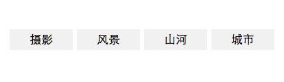

Btn-groups
---

### Install
```sh
aimee i btn-groups --save
```

### Usage
```js
var data = {
    list: [
        {
            val: '摄影',
            url: 'javascript:;'
        },
        {
            val: '风景',
            url: 'javascript:;'
        },
        {
            val: '山河',
            url: 'javascript:;'
        },
        {
            val: '城市',
            url: 'javascript:;'
        },
    ]
}
```

```js
this.exports('btn-groups', data)
```

### Preview
